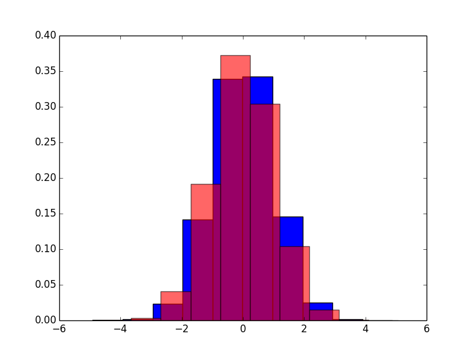

Say I would like to take samples from a probability distribution with probability distribution function f.  By samples, in this case, I mean a sequence of numbers that follow a very specific pattern, modeled by the probability distribution I care about. For example, I may want to simulate a stochastic process, as is often done in finance or biology. You can sample from a very well known, discrete distribution very easily. Simply throw a coin ten times in the air, catch it and write down 0 if it's head, 1 if it's tails. The resulting sequence of numbers is a sample of the distribution. Note here that what's important is the sequence of the numbers, not the numbers themselves.  If we picked 2 and -5 or goat and monkey instead of 0 and 1, the distribution of them would be the same, even though our representation of it would not.

## Why are we interested in a bunch of numbers?

Because those numbers carry information about the random process! Using them, we can calculate infinite sums, integrals, probabilities, you name it.

## In deep waters ...

While it may not seem like it, this is actually a huge problem, with countless methods for different instances of it. It's very important for scientists to be able to simulate (another expression for "take samples") from the distribution they care about.  Depending on what we know about the distribution, I may be able to get those samples easily (with 1 - 3 lines of code in any modern computer programming language) or I may have to write and test my own method. The purpose of this particular post is not to talk about every such method though. Believe me, there are  a lot of them out there! When we are lucky, we may be able to calculate another object, called the cumulative distribution function,

$$F(x)=\int_{-\infty}^{x}f(y)dy$$

If we are even luckier, we may be able to invert it and, finally, if we are drowning in luck, perhaps the inverse, $$F^{-1}$$ will have a nice and short formula.

Why so interested in the cdf? Because of a nice method for sampling called the inverse transform method which states that as long as we can invert F, we can also sample from it. For quick reference, if $$F^{-1}$$ is the inverse of the cdf and $$u\sim U[0,1]$$, then $$F^{-1}(u)$$ follows the distribution with cdf F.

After I invert F, I have to evaluate $$F^{-1}$$ a lot of times. How many times, you ask? As many as the samples we want to use and usually, we want a lot of them. If the inverse of the cdf is costly to evaluate or impossible to write down, a good alternative could be to use interpolation to approximate it.  Let's take a look at the whole trick with an example.

##Example

Let's say that we want to pick samples from the standard normal distribution, which has a probability density function

$$ p(x)=\frac{e^{-x^2/2}}{\sqrt{2\pi}}$$

As this probability distribution pops up everywhere (see central limit theorem), there are many ways to pick samples from it.  But let's continue. We know from before the definition of the cdf, so in this case it will be,

$$ F(x)=\int_{-\infty}^{x}\frac{e^{-t^2/2}}{\sqrt{2\pi}}dt$$

Unfortunately, it's not obvious how to invert F, so it won't be easy to sample from the standard normal.

Here's what we are gonna do. First, we will take a set of points $$ \{ x_{i}\}$$ in [-6,6] and define $$y_{i} = F(x_{i})$$. In python,

~~~ python
# PDF of the standard normal distribution.
p = lambda t : exp(-t**2/2.0)/sqrt(2*pi);
# CDF of the standard normal distribution.
F = lambda x : (quad(p,-inf,x))[0];
# Take discrete points (x,F(x))
Ns = 40;
x = linspace(-6,6,Ns);
y = zeros(Ns)
for i in xrange(Ns):
 y[i] = F(x[i]);
# Interpolate F
Fint = interp1d(x,y);
~~~
{: .language-python}

Plotting the points, along with an 1D interpolation of them using a linear spline gives,

<iframe width="800" height="480" frameborder="0" seamless="seamless" scrolling="no" src="https://plot.ly/~kgourgou/21/640/480"></iframe>

In order to progress, we need an approximation for the inverse of the interpolating polynomial (shown in green above).  Perhaps surprisingly, this isn't so difficult as it sounds. One solution is to interpolate backwards, i.e,

~~~ python
Finv = interp1d(y,x);
~~~

Thus, since by definition $$ Fint(x_i)=y_i$$ and $$ Finv(y_i)=x_i$$ for all i's, we arrive at $$ Finv(Fint(x_i))=x_i$$. So, it seems it was a good idea to interpolate backwards. Now, let's try to sample.

## Sampling from the distribution by using Finv

The algorithm states that if we wish for N samples from the distribution with cdf F, we should generate N samples from the uniform distribution in [0,1] and then use the inverse of F to get the samples we need.  Let's try that, using Finv instead of $$ F^{-1}$$

~~~
N = 1e+6;
u = rand(N)
# Now, we need to calculate Finv(u), which will
# gives us the samples we want.
x = Finv(u);
~~~

The mean and variance of our samples are -0.00028 and 1.02046 respectively. Not bad, right?  Here's a comparison between the histogram of our samples and one that we got with another method. histogram

##Pitfalls & Advantages

OK. So the method works and allows us to  generate samples from a distribution, given its cdf. Now let's take a moment to think about some of the dangers/assumptions of this method.

* It assumes that the inverse of the cdf is approximated by a polynomial of degree p. That may or may not be the case. Luckily, we can use the usual smoothness arguments & upper bounds to say something here. :-)

* We are not really sampling from F but from a distribution close to F. Remember that F is defined for every $$x\in\mathbb{R}$$ whereas our Fint is only defined in an $$ [-a,b]$$. Unless we use a large (and distribution specific) interval, we are bound to lose some of the rare events of the distribution.

* We need to  balance the number of points we use for the interpolation with the accuracy of the sampling. The problem is not the construction of the interpolating polynomial/spline. That only has to happen once, in the beginning of the whole process. The problem is the evaluation of Finv, which may (and will) be expensive if we used a lot of nodes in the beginning.

**And what we gained**,

* We don't have to move on to a more complicated method immediately after we find out that F is difficult to invert.

* This method works verbatim for almost arbitrary F. Even if your f is an ugly function which, god knows how, it qualifies to be a pdf, this method will try to give you samples that follow that f.
    
* It has a "Why didn't I think of that?" vibe!

